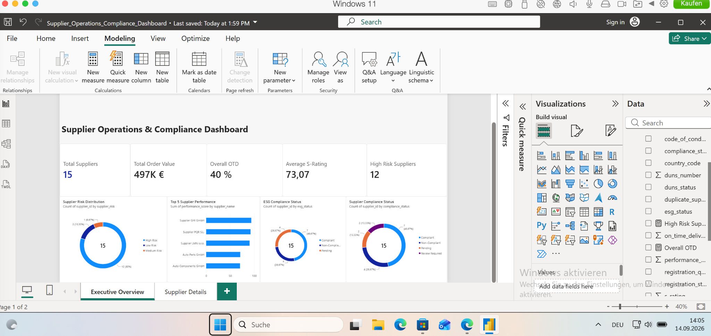
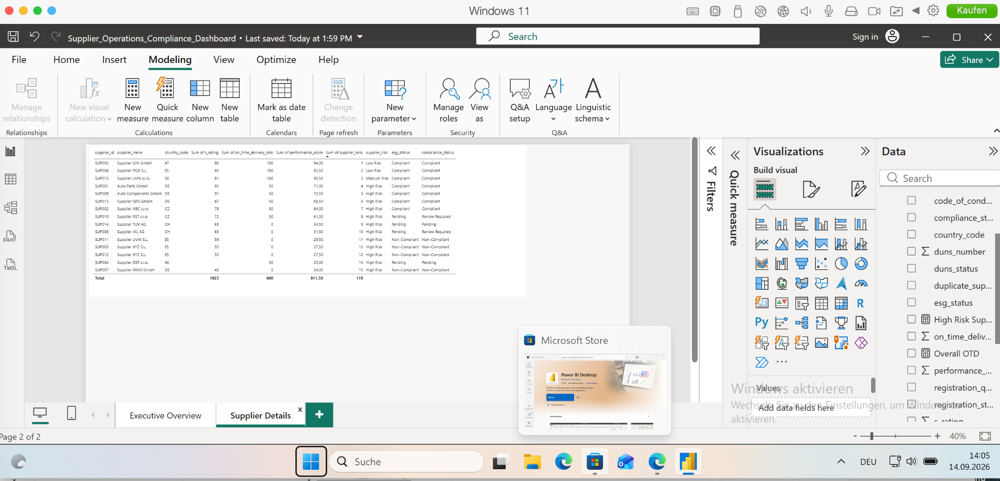

# Supply Chain Supplier Compliance & Performance Analytics

End-to-end supply chain analytics project focused on **supplier performance, delivery reliability, compliance, ESG status, supplier risk management and management reporting**.

The project combines **Python, Pandas, SQL, SQLite and Power BI** to transform raw supplier and order data into management-ready KPIs, supplier risk classifications, performance rankings and an interactive dashboard.

> **Note:** This project uses synthetic data created for portfolio and learning purposes. It is inspired by common supplier management and compliance processes in the automotive supply chain and does not contain confidential company data.

---

## Business Problem

Procurement and supply chain teams need a clear view of supplier performance across multiple dimensions:

- On-time delivery
- Supplier quality and reliability
- Sustainability / ESG status
- Supplier compliance
- Supplier registration quality
- DUNS status
- Delayed orders
- Supplier risk classification
- Supplier performance ranking

The goal of this project is to transform fragmented supplier, compliance and order data into a structured analytical workflow that supports supplier monitoring and management decisions.

---

## Project Workflow

```text
Raw CSV Data
    ↓
Python Data Cleaning
    ↓
Clean CSV Data
    ↓
Python → SQLite Data Load
    ↓
SQL Data Verification
    ↓
SQL Supplier Performance Analysis
    ↓
Python Supplier KPI Analysis
    ↓
Management-Ready KPI Dataset
    ↓
Power BI Dashboard
```

---

## Project Structure

```text
supply-chain-supplier-compliance/
│
├── data/
│   ├── suppliers_raw.csv
│   ├── orders_raw.csv
│   ├── compliance_raw.csv
│   ├── suppliers_clean.csv
│   ├── orders_clean.csv
│   ├── compliance_clean.csv
│   └── supplier_kpi_analysis.csv
│
├── python/
│   ├── data_cleaning.py
│   ├── load_to_sql.py
│   └── supplier_analysis.py
│
├── sql/
│   ├── 01_create_tables.sql
│   ├── 03_verify_data.sql
│   ├── 04_supplier_performance.sql
│   └── 05_management_dashboard.sql
│
├── powerbi/
│   ├── Supplier_Operations_Compliance_Dashboard.pbix
│   └── screenshots/
│       ├── executive_overview.png
│       └── supplier_details.png
│
└── README.md
```

---

## Data Cleaning with Python

Python and Pandas are used to validate and clean raw supplier, order and compliance data.

The cleaning process identifies issues including:

- Missing DUNS numbers
- Invalid supplier registration data
- Missing S-Ratings
- Duplicate supplier names
- Incomplete compliance records
- Delayed deliveries
- Significantly delayed deliveries

Example data quality findings:

- Missing DUNS numbers: **4**
- Missing S-Rating values: **1**
- Incomplete registrations: **5**
- Duplicate supplier names: **2**
- Delayed orders: **18**
- Significantly delayed orders: **11**

---

## SQL Analysis

The cleaned datasets are loaded into SQLite using Python.

SQL is then used to calculate supplier-level performance metrics including:

- Total orders
- Total order value
- On-time orders
- Delayed orders
- On-time delivery rate
- Compliance status
- ESG status
- Supplier risk
- Performance score
- Supplier ranking

### Supplier Risk Logic

Suppliers are classified using the following business rules:

**High Risk**

- S-Rating < 70
- OR On-Time Delivery < 70%
- OR ESG status is not Compliant
- OR Compliance status is not Compliant

**Medium Risk**

- S-Rating < 85
- OR On-Time Delivery < 90%

**Low Risk**

- Supplier meets the required performance and compliance thresholds

---

## Performance Score

A combined supplier performance score is calculated using:

```text
Performance Score =
50% On-Time Delivery Rate
+
50% S-Rating
```

Suppliers are then ranked using the resulting score.

---

## Key Results

The analysis covers:

- **15 suppliers**
- **30 orders**
- **€496,500 total order value**
- **73.07 average S-Rating**
- **40% overall on-time delivery rate**

### Supplier Risk Distribution

- **12 High Risk suppliers**
- **1 Medium Risk supplier**
- **2 Low Risk suppliers**

### Top Supplier Performance

| Rank | Supplier | Performance Score |
|---:|---|---:|
| 1 | Supplier GHI GmbH | 94.0 |
| 2 | Supplier PQR S.L. | 92.5 |
| 3 | Supplier LMN s.r.o. | 90.5 |
| 4 | Auto Parts GmbH | 71.0 |
| 5 | Auto Components GmbH | 70.5 |

---

## Power BI Dashboard

The final analytical dataset is visualized in Power BI through a management-focused **Supplier Operations & Compliance Dashboard**.

### Dashboard Preview

#### Executive Overview



#### Supplier Details



### Executive Overview

The dashboard includes:

- Total Suppliers
- Total Order Value
- Overall On-Time Delivery Rate
- Average S-Rating
- High Risk Suppliers
- Supplier Risk Distribution
- Top 5 Supplier Performance
- ESG Compliance Status
- Supplier Compliance Status

### Supplier Details

A second report page provides a detailed supplier-level view including:

- Supplier ID
- Supplier Name
- Country
- S-Rating
- On-Time Delivery Rate
- Performance Score
- Supplier Rank
- Supplier Risk
- ESG Status
- Compliance Status

The Power BI file is available in:

```text
powerbi/Supplier_Operations_Compliance_Dashboard.pbix
```

---

## Management Insights

The analysis highlights several management-relevant findings:

- Overall on-time delivery performance is low at **40%**.
- **12 of 15 suppliers** are classified as High Risk.
- Supplier risk is driven by a combination of delivery performance, sustainability ratings and compliance status.
- A small number of suppliers show strong performance and can be used as internal benchmarks.
- Supplier data quality issues such as missing DUNS numbers and incomplete registration records can directly affect supplier monitoring.
- Combining operational, compliance and ESG indicators provides a more complete supplier performance view than using delivery KPIs alone.

---

## Technologies Used

### Python
- Pandas
- Data cleaning
- Data validation
- KPI calculation
- Supplier risk classification

### SQL
- SQLite
- JOINs
- CTEs
- CASE statements
- Aggregations
- Window functions
- Supplier ranking
- Management reporting

### Power BI
- KPI cards
- Supplier risk visualization
- Supplier performance ranking
- ESG and compliance reporting
- Supplier-level management dashboard

### Additional Tools
- Git
- GitHub
- Visual Studio Code

---

## Skills Demonstrated

This project demonstrates practical skills in:

- Supply Chain Analytics
- Supplier Performance Management
- Supplier Compliance
- ESG / Sustainability Analytics
- Procurement Analytics
- Data Cleaning
- KPI Development
- SQL Analysis
- Python / Pandas
- Power BI
- Business Reporting
- Data Quality Management
- Risk Classification

---

## Portfolio Context

This project is designed to reflect a realistic supplier management workflow and connects technical analytics skills with practical supply chain and supplier operations use cases.

It demonstrates an end-to-end analytical process from raw data through Python and SQL analysis to a management-ready Power BI dashboard.